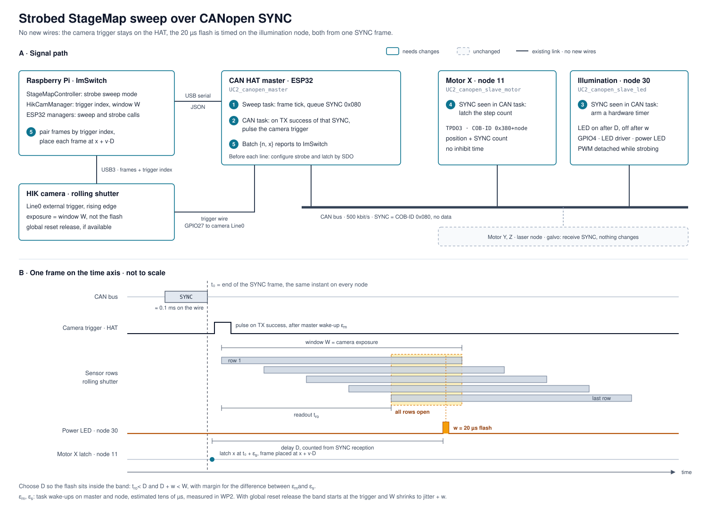

# Strobed StageMap sweep over CANopen SYNC

*WP1–WP8 implemented 2026-09-29, not yet tested on hardware · work packages and file list:
[STROBED_STAGEMAP_WORKPACKAGES.md](STROBED_STAGEMAP_WORKPACKAGES.md)*

## Goal

The StageMap prescan sweeps X at constant speed while the rolling-shutter HIK camera runs
free. Frames are skewed and motion-blurred, and they are placed by host wall-clock time plus
a calibrated lag. The goal is one 20 µs flash of the power LED per frame, so every row of
the sensor sees the same instant and motion is frozen.

**Constraint: no new wires.** The camera trigger stays on the CAN HAT master (GPIO27 to
camera Line0). Motors and the power LED stay on CAN nodes.

## Idea: one wire event, two edges

The end of a CANopen SYNC frame happens at the same instant on every node. The master
pulses the camera trigger when its own SYNC transmission completes. The illumination node
flashes a fixed delay D after it receives that SYNC. The X motor node latches its position
on the same SYNC. No clocks need to be synchronised.

Per frame, numbered as in the diagram:

1. The master's sweep task ticks at the frame period and queues a SYNC frame
   (COB-ID 0x080, no data).
2. The master's CAN task gets the TX-success alert for that frame and pulses the camera
   trigger. The TWAI driver runs without its internal TX queue, so only one frame is in
   flight and the alert is unambiguous.
3. The illumination node (node 30, `UC2_canopen_slave_led`) timestamps the SYNC in its CAN
   task and arms a hardware timer: GPIO4 high after D, low after w. The PWM peripheral is
   detached from GPIO4 while strobing.
4. The X motor node (node 11) latches its step count at the same point and sends it in
   TPDO3 (COB-ID 0x380 + node).
5. The master batches `{n, x}` reports to ImSwitch. ImSwitch pairs each frame by the
   camera's trigger index and places it at `x + v·D`.

The time-critical work runs in `CAN_ctrl_task` (priority 5), which already wakes on the
TWAI hardware alert and sees every raw frame before the CANopen stack does. The remaining
jitter is two task wake-ups, estimated at tens of µs. Jitter in the frame period itself is
harmless because positions are latched, not computed.

## Why today's firmware cannot do it

| Path | Today | Consequence |
|---|---|---|
| SYNC production | Every node is consumer only (0x1005 = 0x80, 0x1006 = 0). The stack's producer would tick from the 1 ms timer task. | No SYNC on the bus, and a producer would be unrelated to the trigger pin. |
| SYNC reception | `CO_SYNC_initCallbackPre` exists but is unregistered. Frames reach the stack through `CO_interrupt_task`, priority 2, polling every 1 ms. | Any stack-level hook inherits up to 1 ms of jitter. |
| LED | SDO write, object dictionary, 1 ms timer, main loop, then `ledcWrite` at 10 kHz PWM. | Millisecond latency. A 20 µs window catches a random slice of a 100 µs PWM period. |
| Position | TPDO1, event-driven, 10 ms inhibit. | No position for a given instant. |

## The camera exposure becomes a window

The exposure no longer sets the image brightness. It is a window that must contain the
flash for every row.

| | Plain rolling shutter | Global reset release |
|---|---|---|
| Minimum window W | readout + jitter + flash, about 16 ms | jitter + flash, about 0.5 ms |
| Frame period | about 31 ms, ~32 fps | about 16 ms, ~65 fps |
| Ambient light for 1 % contamination | ≤ 1e-5 of LED intensity | ≤ 4e-4 of LED intensity |
| Motion blur at 30 mm/s | 0.6 µm | 0.6 µm |

Assumes 15 ms full-frame readout and a 20 µs flash. A smaller ROI height shortens the
readout proportionally. With plain rolling shutter the sensor integrates stray light for
the whole window, so the enclosure must be nearly dark.

## Using it

- **Switch:** the Strobe checkbox next to Prescan in the well selector, or "Strobed
  sweep" in the stage map settings. Both set `prescanStrobe`; `startPrescan?strobe=true`
  does the same. The start message says whether strobing runs, or why not.
- **Timing panel:** the tune button next to the checkbox holds flash width, flash
  delay (empty = end of the window), exposure window, shortest frame period, trigger
  pulse and target brightness. Values save on blur and persist in
  `config/stagemap_strobe.json`.
- **Calibrate:** with the stage still, `calibrateStageMapStrobe` (1) sweeps the delay
  and keeps the middle of the range where one flash lights every row, (2) scales the
  flash width to the target brightness, keeping half the timing margin, and (3) fires
  frames at the prescan's shortest period and checks one evenly lit frame per trigger.
  It lengthens the period while the camera skips triggers and stores the first period
  that works. The answer lists what it found, e.g. "Every trigger gave one frame lit by
  one flash, at one frame per 31.0 ms."

## Targets

| Metric | Target |
|---|---|
| Flash width | 20 ± 1 µs |
| Camera-trigger-to-flash jitter | p99 ≤ 100 µs |
| Dropped frames at the target rate | 0 |
| Motion blur at 30 mm/s | ≤ 1 px |
| LED state after stop, error, bus-off or reset | off |

## Open risks, measured first (WP0)

1. **LED driver response to a single 20 µs pulse from idle.** The node config requires
   ≥ 10 kHz PWM, which hints at a dimming input that may have a soft-start. If the driver
   cannot produce a clean 20 µs flash, the design fails regardless of timing.
2. **HIK model specifics.** Readout time at the ROI used, availability of global reset
   release, maximum trigger rate, trigger caching.
3. **Wake-up jitter** of the CAN tasks with Bluetooth on the master and the LED ring active
   on the illumination node.

## Scope

- **In:** one strobed channel, the power LED on master logical laser 4. Constant-velocity X
  sweeps from StageMap. Standard CANopen SYNC with no counter.
- **Out:** multi-channel or multi-colour strobing, per-channel exposure tables, new wiring.
- **uc2canopen** without the ESP32 master cannot run the sweep, because the camera trigger
  is wired to the HAT. It serves as the bench tool for testing nodes in isolation.
- **Config note:** `seeed_xiao_esp32s3_can_slave_illumination` is the legacy non-CANopen
  build. All illumination-node changes go into `UC2_canopen_slave_led`.
