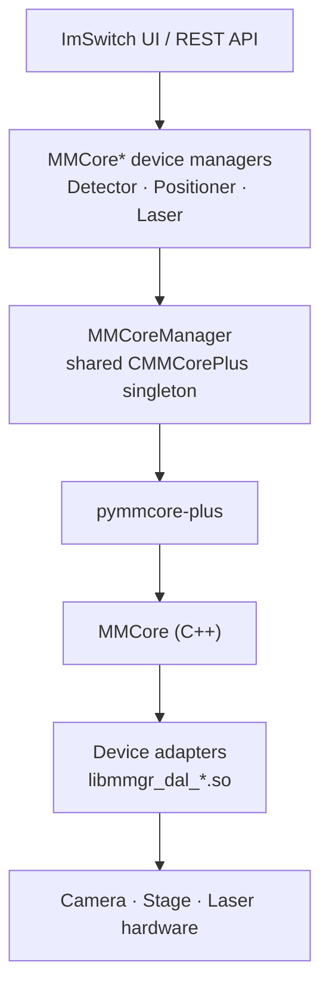
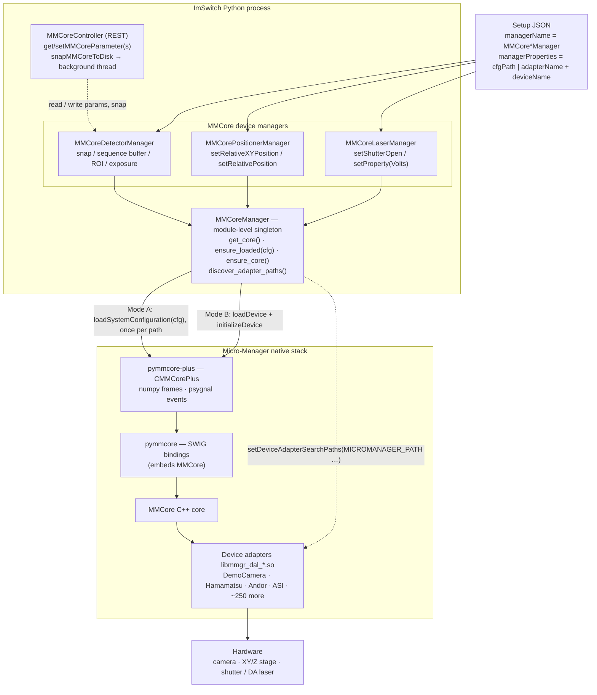

# pymmcore-plus integration

ImSwitch can drive any camera, stage, or laser that has a Micro-Manager
device adapter — Andor, Hamamatsu, Basler, ASI, Prior, Thorlabs, Coherent
and ~250 others — through the [`pymmcore-plus`][pymmcore-plus] Python
bindings to the Micro-Manager `MMCore` C++ library.

There is **no Java**, **no MMStudio**, and **no separate server process**:
`pymmcore-plus` loads the same C++ adapters that MMStudio uses directly
into the ImSwitch Python process.

## Architecture at a glance

### Simplified

The whole integration is one straight pipe: ImSwitch's generic device
managers talk to a single shared core, which loads the vendor C++ adapter
that actually drives the hardware.



### A little more complex

The setup JSON's `managerName` decides which manager wraps each device.
All three managers funnel through the **one** process-wide `MMCoreManager`
singleton, so a single `.cfg` (or set of `loadDevice` calls) drives every
device without USB/serial conflicts. `pymmcore` statically embeds MMCore;
the adapters are loaded at runtime from the discovered search path.



> These diagrams use [Mermaid](https://mermaid.js.org/), which GitHub renders
> natively in Markdown.

## What you get

Three new device managers, picked up by the standard `managerName`
mechanism in your setup JSON:

| Manager class               | Replaces                | Wraps                              |
|----------------------------|--------------------------|------------------------------------|
| `MMCoreDetectorManager`     | Camera-specific manager  | `core.snap()`, sequence acquisition |
| `MMCorePositionerManager`   | Stage-specific manager   | XY + Z stage devices                |
| `MMCoreLaserManager`        | Laser-specific manager   | Shutter or DA property device       |

All three share a process-wide `CMMCorePlus` singleton (see
[`MMCoreManager.py`](../imswitch/imcontrol/model/managers/MMCoreManager.py))
so a single `.cfg` file drives every device without USB conflicts.

## Installation

> **Micro-Manager 2.0 is required** (Device API ≥ 70). The `pymmcore` /
> `pymmcore-plus` Python wheels are built against the MM 2.0 device
> interface; MM 1.4 adapters will fail with an *“interface version
> mismatch”* error on load.

```bash
pip install "ImSwitchUC2[pymmcore]"
# or, in a dev checkout:
pip install -e ".[pymmcore]"
```

To install the Micro-Manager 2.0 device adapters themselves, choose the
option that matches your platform:

| Platform | Recommended install                                                                 |
|----------|--------------------------------------------------------------------------------------|
| Windows  | Download MM 2.0 from <https://micro-manager.org/Micro-Manager_Nightly_Builds> – the installer drops adapters in `C:\Program Files\Micro-Manager-2.0` and ImSwitch picks them up automatically. |
| macOS    | Download the MM 2.0 nightly `.dmg`; drag to `/Applications/Micro-Manager-2.0`. |
| Linux x86_64 | `pip install "pymmcore-plus[cli]"` then `mmcore install` – downloads the official MM 2.0 adapters into pymmcore-plus' managed directory. |
| Raspberry Pi (arm64) | Build from source via [`install_micromanager_raspi.sh`](../install_micromanager_raspi.sh) or use the prebuilt tarball from the [`build-mm-arm64`](../.github/workflows/build-mm-arm64.yml) workflow. |

### Adapter path discovery

`MMCoreManager.discover_adapter_paths()` resolves adapter directories in
the following order:

1. `MICROMANAGER_PATH` environment variable (override).
2. `pymmcore_plus.find_micromanager()` – knows about `mmcore install`
   managed installs and any system installs it can find.
3. Platform-specific MM 2.0 install locations:
   * **Windows:** `C:\Program Files\Micro-Manager-2.0*`,
     `C:\Program Files (x86)\Micro-Manager-2.0*`
   * **macOS:** `/Applications/Micro-Manager-2.0*`,
     `/Applications/Micro-Manager.app/Contents/Resources`
   * **Linux:** `/opt/micro-manager/lib/micro-manager`,
     `/opt/Micro-Manager-2.0*`, `/usr/local/lib/micro-manager`
4. pymmcore-plus' managed install dir on every platform
   (`~/.local/share/pymmcore-plus/mm/Micro-Manager-*` and OS-specific
   equivalents).

On **Windows**, every resolved directory is also added to the Python
DLL search path via `os.add_dll_directory`, so vendor SDK DLLs co-located
with the adapter (e.g. Andor, Hamamatsu) are found automatically.

You can override the search at any time by setting `MICROMANAGER_PATH`,
or per-device via the `adapterPath` key in the setup JSON.

## Quick start: the DemoCamera setup

The [`example_mmcore_demo.json`](../imswitch/_data/user_defaults/imcontrol_setups/example_mmcore_demo.json)
setup uses the `DemoCamera` adapter that ships with every Micro-Manager
install — no `.cfg` file required.

```bash
imswitch --setup example_mmcore_demo.json
```

You should see a `MMCamera` detector, a `MMStage` XYZ positioner, and
the `MMShutter` laser show up in the UI immediately.

## Using a real camera

Two configuration modes are supported.

### Mode A — write a Micro-Manager `.cfg` file

Configure your hardware once with `MMConfig.exe` (or by hand) and point
ImSwitch at the resulting file. Multiple managers can share the same
`.cfg`; it is loaded only once per process:

```json
{
  "detectors": {
    "AndorCamera": {
      "managerName": "MMCoreDetectorManager",
      "managerProperties": {
        "cfgPath": "/home/pi/configs/Andor_ASI.cfg",
        "deviceLabel": "Andor sCMOS Camera"
      },
      "forAcquisition": true
    }
  }
}
```

A complete example lives in
[`example_mmcore_andor.json`](../imswitch/_data/user_defaults/imcontrol_setups/example_mmcore_andor.json).

### Mode B — declare the device inline

Skip `.cfg` files entirely by listing the adapter and device name in the
manager properties — handy for quick demos:

```json
{
  "detectors": {
    "Cam": {
      "managerName": "MMCoreDetectorManager",
      "managerProperties": {
        "adapterName": "HamamatsuHam",
        "deviceName":  "HamamatsuHam_DCAM",
        "deviceLabel": "Hamamatsu"
      },
      "forAcquisition": true
    }
  }
}
```

## Discovering adapters and devices

Use the helpers on `MMCoreManager` to introspect what is installed:

```python
from imswitch.imcontrol.model.managers import MMCoreManager

# All adapters present on disk
print(MMCoreManager.get_available_adapters("/opt/micro-manager/lib/micro-manager"))

# Devices a specific adapter exposes (requires the singleton to be alive)
core = MMCoreManager.get_core()
print(MMCoreManager.get_available_devices_for_adapter("HamamatsuHam"))
```

## Running fully headless on Raspberry Pi (Docker + prebuilt arm64 adapters)

There are **no prebuilt Micro-Manager device adapters for arm64**, and the
`pymmcore` wheel on PyPI has no `linux-aarch64` build. The
[`build-mm-arm64.yml`](../.github/workflows/build-mm-arm64.yml) workflow
solves the hard half: it cross-compiles `mmCoreAndDevices` for aarch64 in an
emulated container and uploads **`micro-manager-arm64.tar.gz`** (~118 MB)
containing

```
./micro-manager/lib/micro-manager/libmmgr_dal_*.so   ← the compiled adapters
./DEVICE_INTERFACE_VERSION.txt                        ← MODULE_INTERFACE_VERSION the .so files were built against
./ADAPTERS_BUILT.txt                                  ← which adapters made it (vendor-locked ones are skipped)
```

### The one gotcha: device-interface-version matching

`pymmcore` **statically embeds its own copy of MMCore**. At runtime that
embedded core loads the external `libmmgr_dal_*.so` adapters through the
Micro-Manager **Device API**. The adapter's API version and pymmcore's
embedded API version *must match*, or MMCore refuses the adapter with an
*"interface version mismatch"* error. The artifact records its version in
`DEVICE_INTERFACE_VERSION.txt` precisely so you can pin a compatible
`pymmcore`.

> **Safe rule:** build the adapters and `pymmcore` from the *same*
> `mmCoreAndDevices` ref. The workflow builds adapters from `main`, so either
> install a `pymmcore` release whose device API matches, or build `pymmcore`
> from source (`--no-binary pymmcore`) so it compiles against the same tree.

### Where to get the tarball

* **Tagged release (recommended for Docker):** push a tag matching `mm-v*`
  (e.g. `git tag mm-v1 && git push origin mm-v1`). The workflow's *Publish as
  GitHub Release* step then attaches `micro-manager-arm64.tar.gz` as a stable,
  unauthenticated download — ideal for `wget` during an image build:
  `https://github.com/openUC2/ImSwitch/releases/download/mm-v1/micro-manager-arm64.tar.gz`
* **Workflow artifact (ad-hoc):** for an untagged run, grab it from the
  Actions UI or with `gh run download <run-id> -n micro-manager-arm64`. Note
  artifacts are zipped (`micro-manager-arm64.zip` with the `.tar.gz` inside),
  expire after ~90 days, and require auth — so not great for reproducible
  builds.

### How ImSwitch finds the adapters

Extract the tarball so the adapters land at
`/opt/micro-manager/lib/micro-manager/` — that path is already in
`MMCoreManager`'s Linux discovery globs (`_MM2_LINUX_GLOBS`), so **no extra
config is needed**. Setting `MICROMANAGER_PATH` to the same directory makes
it explicit (and is what `install_micromanager_raspi.sh`'s smoke test
expects).

### Recipe A — bake it into the image (reproducible)

Add a build script `docker/build-micromanager.sh`:

```bash
#!/usr/bin/env -S bash -eux
# Only arm64 needs the prebuilt adapters; on amd64 just run `mmcore install`.
[ "$TARGETPLATFORM" = "linux/arm64" ] || { echo "skip: not arm64"; exit 0; }

MM_REF="${MM_REF:-mm-v1}"   # the release tag the adapters were published under
cd /tmp
wget -q "https://github.com/openUC2/ImSwitch/releases/download/${MM_REF}/micro-manager-arm64.tar.gz"
mkdir -p /opt
tar -xzf micro-manager-arm64.tar.gz -C /opt    # -> /opt/micro-manager/lib/micro-manager/*.so
cat /opt/DEVICE_INTERFACE_VERSION.txt || true
rm -f micro-manager-arm64.tar.gz

# pymmcore has no aarch64 wheel on PyPI — build it from source so its embedded
# MMCore matches the adapters' device interface version.
apt-get update
apt-get install -y --no-install-recommends build-essential swig python3-dev libboost-all-dev
source /opt/imswitch/.venv/bin/activate
uv pip install pymmcore --no-binary pymmcore
uv pip install "pymmcore-plus[cli]>=0.10"

# sanity check: embedded device API should match DEVICE_INTERFACE_VERSION.txt
python3 -c "import pymmcore; print('pymmcore API:', pymmcore.CMMCore().getAPIVersionInfo())"

apt-get remove -y build-essential swig
apt -y autoremove && apt-get clean && rm -rf /var/lib/apt/lists/* /tmp/*
```

Wire it into the `Dockerfile` after the deps layer and export the path:

```dockerfile
RUN --mount=type=bind,source=docker/build-micromanager.sh,target=/mnt/build/build-micromanager.sh \
    /mnt/build/build-micromanager.sh
ENV MICROMANAGER_PATH=/opt/micro-manager/lib/micro-manager
```

Then run headless and point a setup at an MMCore device (e.g. the always-present
`DemoCamera`, or a real `.cfg`):

```bash
docker run -it --rm -p 8001:8001 -p 8002:8002 \
  -e HEADLESS=1 -e HTTP_PORT=8001 \
  -e CONFIG_PATH=/config -e DATA_PATH=/dataset \
  -v ~/imswitch-config:/config -v ~/imswitch-data:/dataset \
  --privileged ghcr.io/openuc2/imswitch-noqt-arm64:latest
```

(Use a setup JSON with `managerName: "MMCoreDetectorManager"` plus either
`cfgPath`, or `adapterName: "DemoCamera"` / `deviceName: "DCam"` — see
[`example_mmcore_demo.json`](../imswitch/_data/user_defaults/imcontrol_setups/example_mmcore_demo.json).)

### Recipe B — mount at runtime (no image rebuild)

If `pymmcore` + `pymmcore-plus` are **already in the image** (they must be —
see the gotcha above; only the `.so` adapters live outside), keep the adapters
on the host and bind-mount them:

```bash
# one-time, on the Pi host:
sudo tar -xzf micro-manager-arm64.tar.gz -C /opt   # -> /opt/micro-manager/...

docker run -it --rm -p 8001:8001 -p 8002:8002 \
  -e HEADLESS=1 -e HTTP_PORT=8001 \
  -e MICROMANAGER_PATH=/opt/micro-manager/lib/micro-manager \
  -e CONFIG_PATH=/config -e DATA_PATH=/dataset \
  -v /opt/micro-manager:/opt/micro-manager:ro \
  -v ~/imswitch-config:/config -v ~/imswitch-data:/dataset \
  --privileged ghcr.io/openuc2/imswitch-noqt-arm64:latest
```

Recipe A gives a turnkey headless box; Recipe B is handy while iterating on
which adapter build you want without rebuilding the whole image.

## Raspberry Pi notes

* Use a Pi 5 with **8 GB RAM** for anything beyond the demo adapter.
* Building `mmCoreAndDevices` from source on the Pi takes ~30 minutes;
  prefer the prebuilt tarball from CI.
* Adapters that depend on Windows-only vendor DLLs (e.g. some
  AndorSDK3 builds) cannot be used on Linux — check the vendor's docs.

## Known limitations

* No Java, no MMStudio integration.
* `MMCorePositionerManager.moveForever` is a no-op — Micro-Manager has no
  generic jog primitive.
* Laser power calibration is the user's responsibility: `mode: "property"`
  writes a raw value (typically volts).
* Some adapter properties expose values that don't fit our number/list
  parameter widgets; those properties are silently skipped in the UI but
  remain settable via `setProperty` calls.

[pymmcore-plus]: https://pymmcore-plus.github.io/pymmcore-plus/
